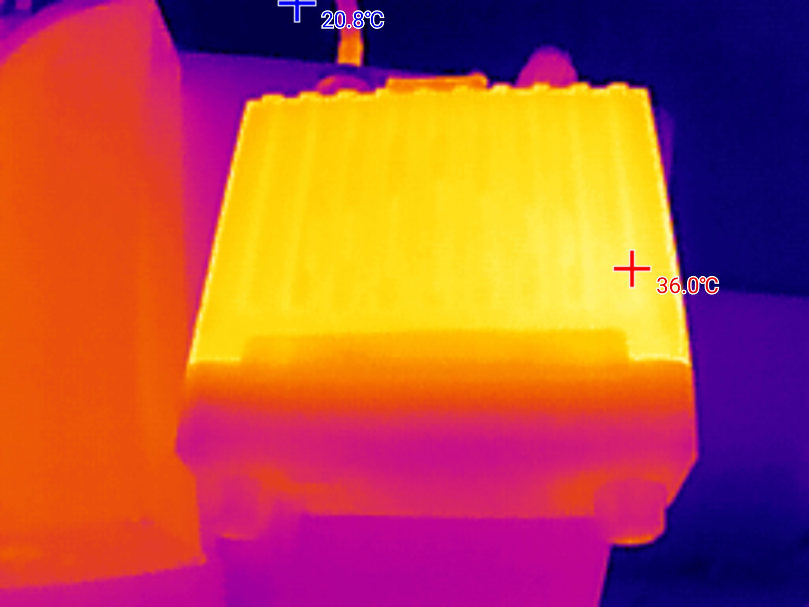
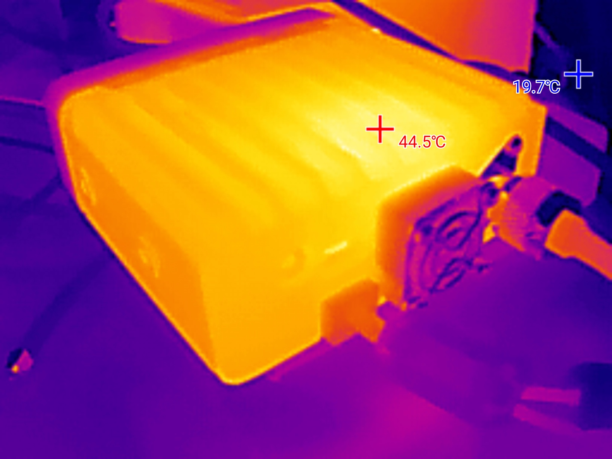

# :radio: Measurements for the Hiroyasu IC-980Pro Max
> :pencil: Real-world measurements. No marketing numbers.

---

## :satellite: Power Output

| Frequency | Band   | Power | RF Power (W) (Nissei RX-503 - Antenna) | RF Power (W) (Nissei RX-503 - Dummy Load) | SWR (Nissei RX-503) |  SWR (NanoVNA) | Comment          |
| --------- | ------ | ----- | ------------ | ------------------- | ------------- | --------------- | -- |
| 145 MHz   | VHF    | Low   | 7.1 W        | 7.4W | ~1.1–1.2            | ~1.32         | 🔥 Very Good    |
| 145 MHz   | VHF    | High  | 20 W         | 23W |   ~1.2–1.3            | ~1.32         | 👍 Stable      |
| 435 MHz   | UHF    | Low   | 9.8 W        | 9.9W |  ~1.15               | ~1.37         | 👍 Good         |
| 435 MHz   | UHF    | High  | 24 W         | 22 W |  ~1.05               | ~1.37         | 🔥 Very Good    |
| 446 MHz   | PMR    | High  | 17 W         | Not Measured |  ~1.7–1.8            | ~1.84         | :warning: Warning |
  
---

## :battery: Power Consumption

| Idle Display Off | Idle Display On | VHF Low | VHF High | UHF Low | UHF High | Voltage |
| -------------------- | --------------------| ------- | -------- | ------- | -------- | ------- |
| 0.3 A                | 0.4 A               | 2.7 A   | 4.4 A    | 2.8 A   | 4.8 A    | 13.8 V  |

---

## :thermometer: Thermal Photos / Temperatures (not accurate but relative)

Thermal photo when receiving  

 

Thermal photo when transmitting

---

## :pushpin: Measurement Setup

- Antenna: Diamond VX50
- Dummy Load: 50Ω/200W (used for reference measurements)
- Coax: Hyperflex 5 (~15m)
- Chokes: Two chokes with FT240-43 ferrites on both ends  
- SWR/Power Meter: Nissei RX-503
- VNA: NanoVNA H4 (DiSlord v1.2.46)
- Power Supply: QJE PS30SWIV

Measurements performed on:
- VHF (145 MHz)
- UHF (435 MHz)
- PMR (446 MHz)
