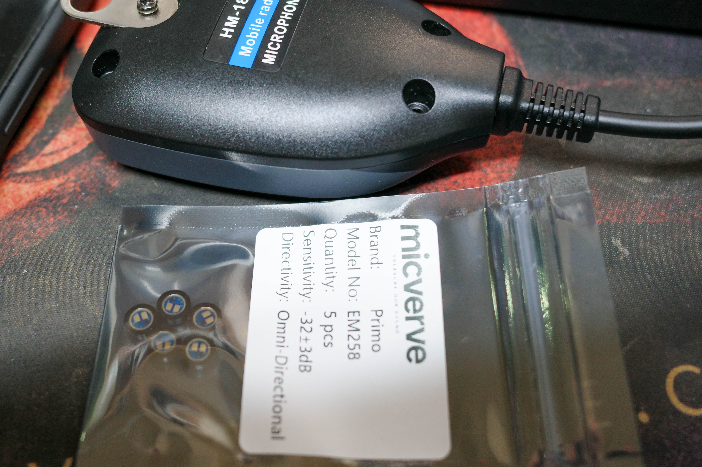
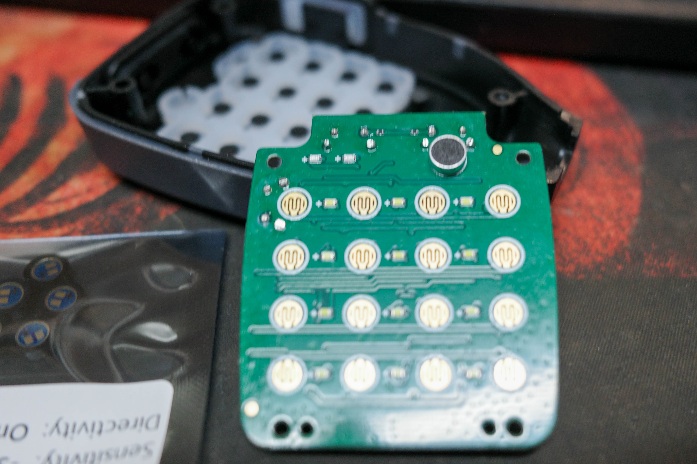
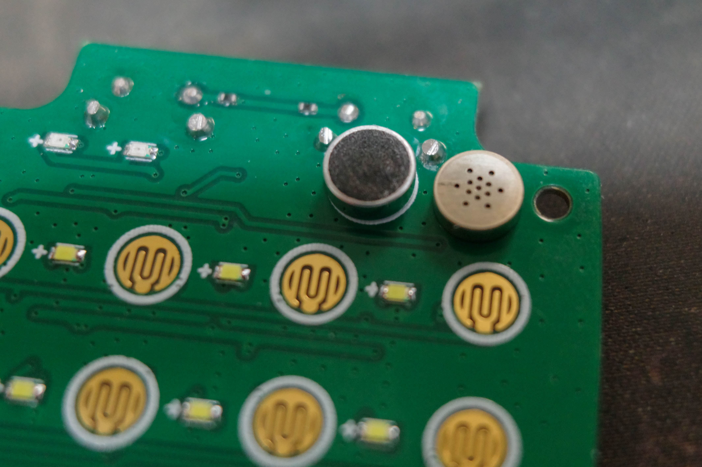
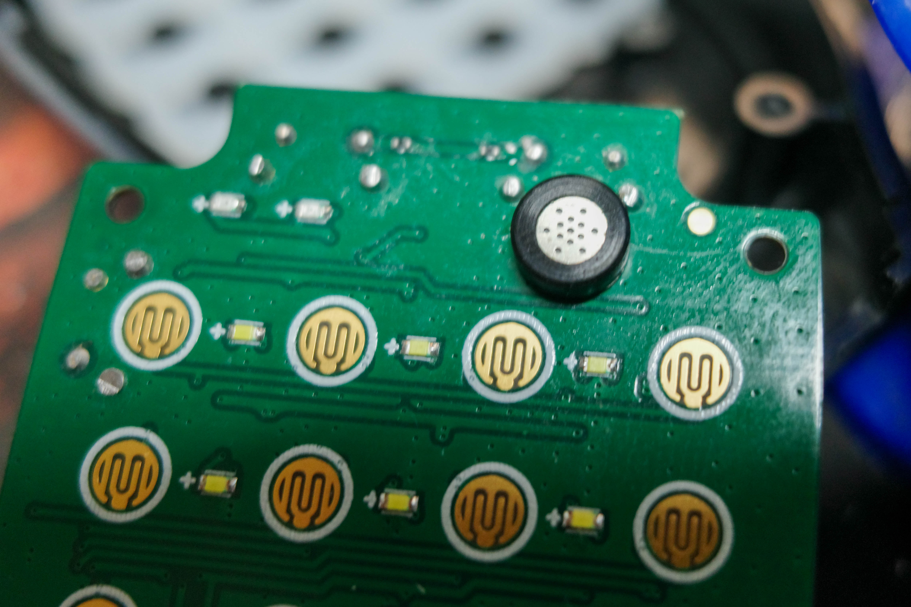
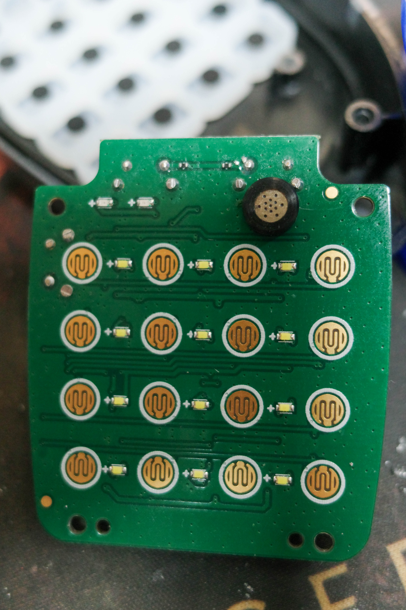
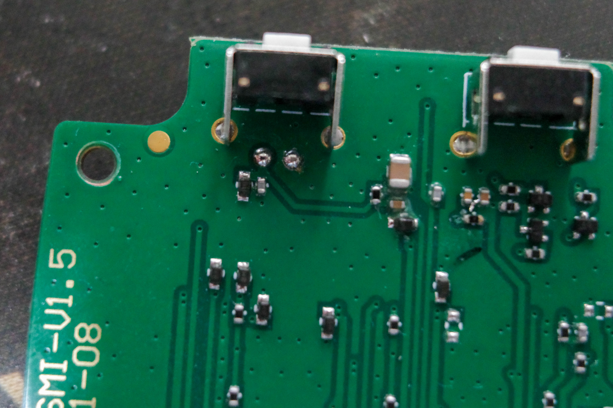
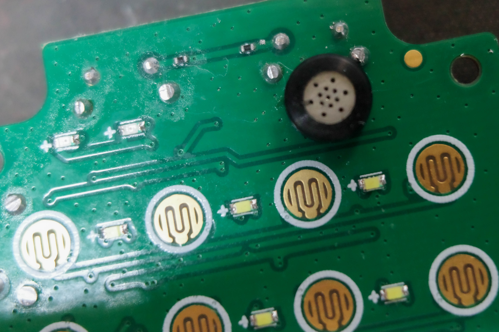

# Hiroyasu HM-18 Microphone Mod

## Replacement of Electret Capsule with Primo EM258

This project documents the replacement of the stock electret microphone capsule in a Hiroyasu HM-158 mobile radio microphone with a higher-quality **Primo EM258** capsule.

---

## 📸 Images

* Microphone and Primo EM258 capsules

  

* Original factory electret capsule (before modification)

  

* Side-by-side comparison (original vs Primo EM258)

  

* New capsule, mechanical fit (perfect match in size)

  

* New capsule installed on PCB

  

* Back side of the PCB

  

* Front side of the PCB

  

---

## ⚙️ Overview

The goal of this modification was to improve the audio quality of the microphone by replacing the stock capsule (typical low-cost electret) with a **Primo EM258**, a well-known low-noise, high-fidelity electret microphone capsule.

---

## ⚠️ Mechanical & Electrical Considerations

Although the **EM258 fits perfectly in size**, there is an important difference:

* The **orientation is correct**, but
* The **pin positions do not match the PCB layout**

### 📌 Key Difference

| Capsule     | Pin Location              |
| ----------- | ------------------------- |
| Original    | Upper half of the capsule |
| Primo EM258 | Lower half of the capsule |

👉 As a result, **direct installation is not possible**, even though the footprint appears compatible.

---

## 🔧 Solution

To resolve the mismatch:

* **0.3 mm enamel (magnet) wire** was used
* The capsule was positioned correctly
* Electrical connections were made manually:

  * * (bias)
  * – (ground)

This allowed proper connection without modifying the PCB traces.

---

## 🔊 Audio Result

After the modification, the audio characteristics changed noticeably:

### Before

* “Transistor-like” sound
* Mid-heavy, narrow, less natural
* Typical communication-grade audio

### After (Primo EM258)

* **Higher fidelity**
* **Fuller / more bass presence**
* Smoother and more natural voice reproduction
* Less harsh in the high-mid range

👉 Overall:
**Less “communication-style”, more natural / hi-fi sound**

---

## 💡 Notes

* This mod favors **audio quality over maximum “cut-through”** in noisy RF environments
* For FM communication, additional EQ or pre-emphasis may be desirable if stronger presence is needed
* Mechanical stability (glue or strain relief) is recommended due to the use of fine wire

---

## 🧾 Conclusion

This is a simple but effective modification that significantly improves microphone audio quality.
It requires minimal components, but careful handling due to the pin mismatch.

---

## 🛠️ Parts Used

* Primo EM258 electret microphone capsule
* 0.3 mm enamel wire

---

## 📊 Specifications (Primo EM258)

The Primo EM258 is a high-quality electret condenser microphone capsule with the following key characteristics:  
  
Directional Pattern: Omni-directional  
Sensitivity: -32 dB ± 3 dB (at 1 kHz, 0 dB = 1 V/Pa)  
Impedance: 1.6 kΩ ± 30% (at 1 kHz)  
Signal-to-Noise Ratio: 74 dB (A-weighted)  
Operating Voltage: 3 V  
Current Consumption: ≤ 550 µA  
Maximum SPL: 115 dB  
Weight: ~0.13 g  
  
According to the manufacturer , the capsule offers high sensitivity and low noise performance, making it suitable for applications where improved audio quality is desired over typical communication-grade capsules.
  
---

## 📎 Disclaimer

Perform this modification at your own risk.
Improper soldering or wiring may damage the microphone or radio.

---
