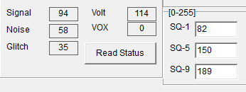
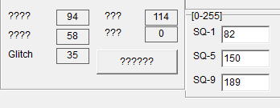

# 📡 Hiroyasu IC-980Pro Max S-Meter Calibration (SQ-1 / SQ-2 / SQ-3)

## 🧠 Background

Out of the box, the S-meter behavior was essentially binary:

- Either **no signal**
- Or **full scale**

This makes the S-meter practically unusable for real-world signal estimation.

---

## 🔍Probable Cause

The issue appears to be related to improperly configured squelch/threshold levels:

- `SQ-1`
- `SQ-2`
- `SQ-3`

These values likely define internal thresholds for mapping signal strength to the S-meter display.

If they are not aligned with the actual RF front-end behavior, the meter saturates.

---

## ⚠️ Note

**Always read and back up the current values before modifying any settings.**

---

## 🛠️ Calibration Method (Practical Approach)

A simple 3-point calibration was performed using the built-in **Read Radio Status** function.  

  
  

> The "Signal" value read from CPS appears to be an internal RSSI-like metric  
> (0–255 scale), used by the firmware to drive squelch and S-meter behavior.  

---

### Step 1 — Baseline (No Antenna)

1. Disconnect the antenna
2. Press **Read Radio Status** (读取机子状态)[^1]
3. Note the **Signal Strength** (信号强度) value

➡ This represents the **noise floor / minimum input level**

→ Set this value as:

> SQ-1 = baseline signal value

---

### Step 2 — Strong Signal Reference

1. Use a second transceiver on the same frequency
2. Transmit a strong signal (close range)
3. Press **Read Status**
4. Note the **Signal** value

➡ This represents a **strong received signal**

→ Set this value as:

> SQ-3 = strong signal value

---

### Step 3 — Midpoint

Calculate a midpoint between SQ-1 and SQ-3:

> SQ-2 = (SQ-1 + SQ-3) / 2

---

## 📊 Example Values

| Parameter | Value |
|----------|------|
| SQ-1 | 82 |
| SQ-2 | 150 |
| SQ-3 | 189 |

---

## 📈 Result

After applying these values:

- The S-meter now shows **intermediate levels**
- Signal strength behaves more **analog-like**
- Weak / medium / strong signals are distinguishable

---

## ⚠️ Notes

- This is a **practical calibration**, not a laboratory-grade one
- The signal scale is **not linear**
- Results may vary depending on:
  - RF environment
  - antenna
  - receiver front-end variations

---

## 🔬 Limitations

- No absolute reference in dBm or S-units
- Strong signal reference depends on:
  - transmitter power
  - distance
  - coupling conditions
- "No antenna" baseline may not represent real-world noise floor

---

## 💡 Future Improvements

Possible enhancements to this method:

- Averaging multiple readings for better accuracy
- Using a calibrated signal generator
- Measuring RSSI vs input power curve
- Fine-tuning SQ-2 (non-linear midpoint)

---

## 🧾 TL;DR

Default S-meter behavior is unusable.

By setting:

- SQ-1 → noise baseline  
- SQ-3 → strong signal  
- SQ-2 → midpoint  

the S-meter becomes **usable and more realistic**.

---

## 🚀 Status

✔ Working  
🔧 Open to improvements

[^1]: Take a look here for translations and using the Adjustment menu of the CPS: https://github.com/vegos/Hiroyasu_IC-980Pro_Max/tree/main/CPS_Explained
