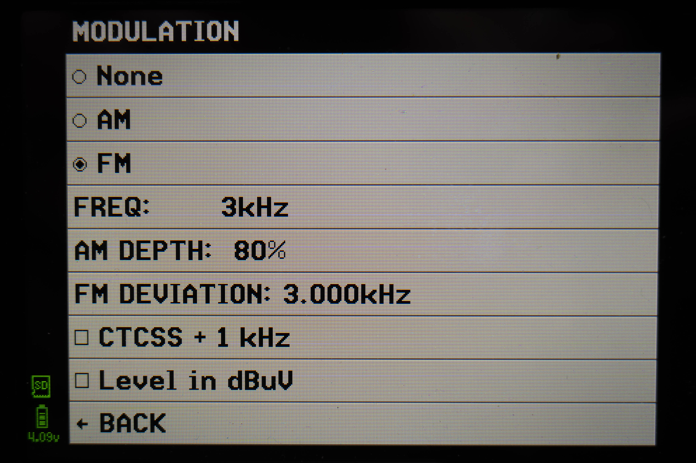
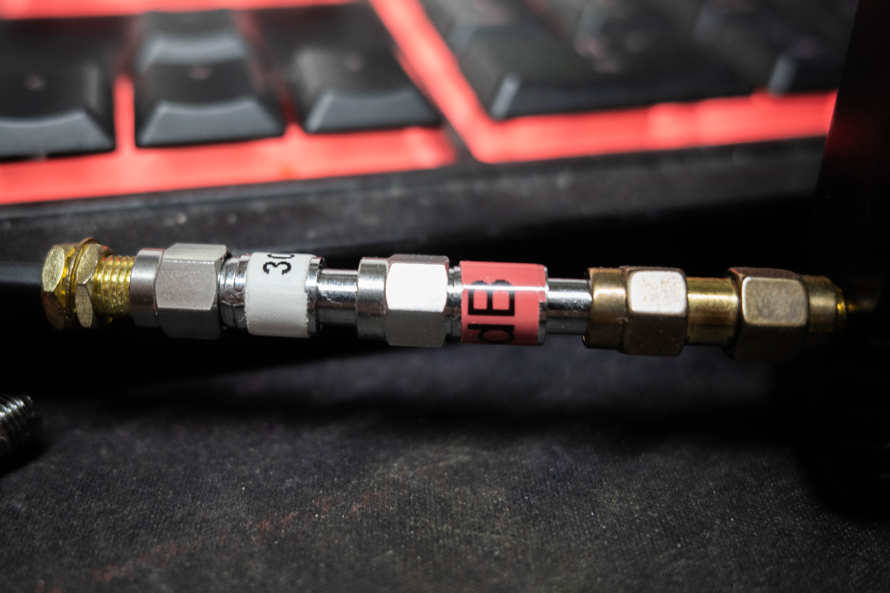
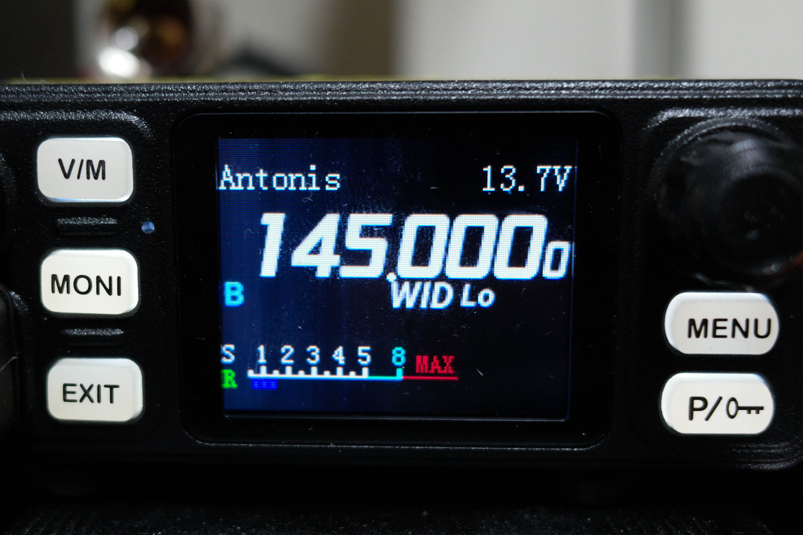
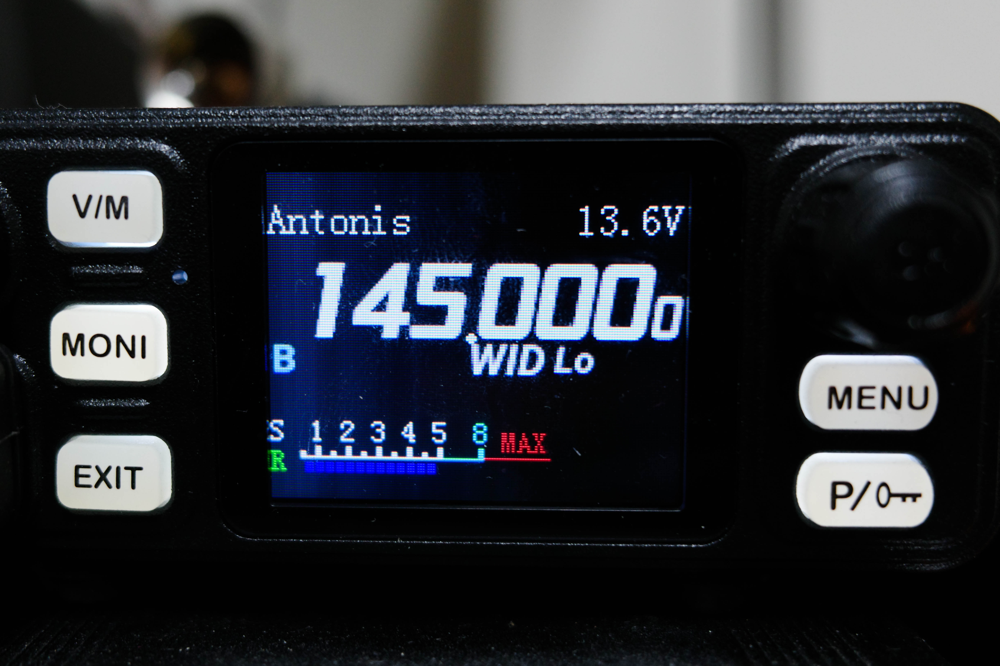
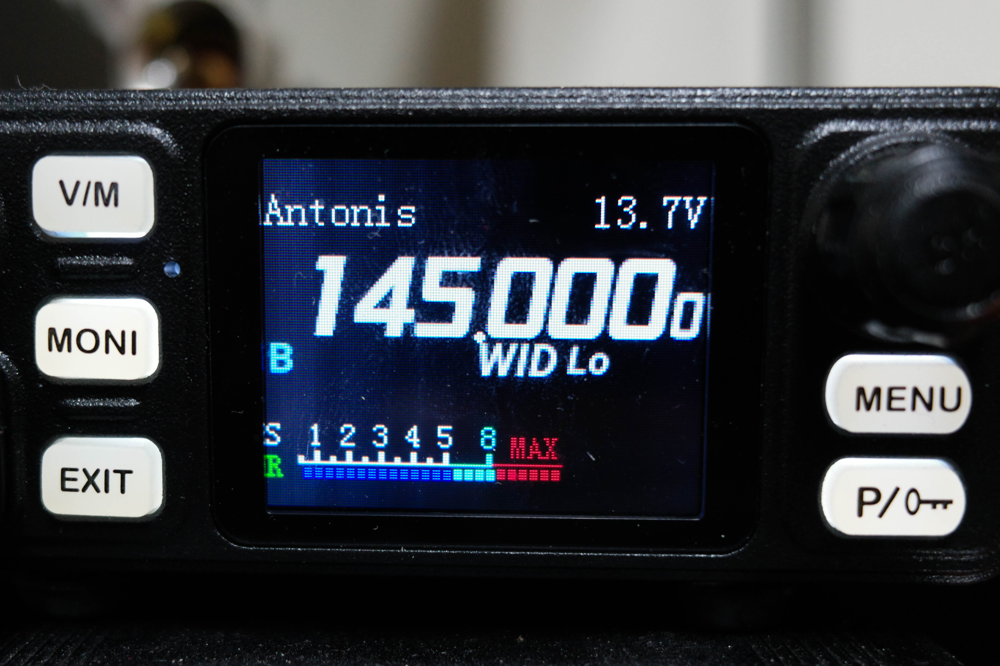

# 📡 Hiroyasu IC-980Pro Max S-Meter Calibration

## Overview

The original calibration procedure was proposed by **[pawol](https://github.com/pawol)/[SP6PW](https://www.qrz.com/db/SP6PW)** in the GitHub [discussion](https://github.com/vegos/Hiroyasu_IC-980Pro_Max/issues/1).

This document describes the calibration procedure that was followed, together with the measured results obtained on **my own radio**.

> **Important:** Calibration values are **radio-specific** and should **not** be copied blindly. Always calibrate your own unit.

---

## Tested Firmware

**Software Version:** `V20251031.01`

---

## ⚠️ Note

**Always read first the current service values and save them as a backup before making any changes.**

---

# Equipment Used

* Hiroyasu IC-980Pro Max
* TinySA Ultra+
* 30 dB SMA attenuator
* 40 dB SMA attenuator
* Total attenuation: **70 dB**
* SMA pigtail
* SMA-to-UHF adapter

---

# Radio Preparation

* Set **Squelch = 0**
* Switch to **Single VFO** mode (`MENU` → `V/M`)
* Tune to **145.000 MHz**
* Enter the hidden **WW01 Service Menu**
* Read and save (backup) the current calibration values

---

# TinySA Configuration

* Put TinySA in **Frequency Generator** mode
* Output Mode: **LOW Output ON**
* Frequency: **145.000 MHz**
* Modulation: **FM**
* Audio Tone: **1000 Hz**
* FM Deviation: **3.0 kHz**
* External Gain: **-70 dB**

The TinySA output was connected directly to the radio antenna connector through two fixed attenuators (30 dB + 40 dB, total 70 dB).

  

  
  
---

# Calibration Procedure

## SQ-1

Set the TinySA output level to **-129 dBm**.

Adjust **SQ-1** until the radio displays exactly **S3**.

Verify the following levels:

| RF Level | Expected Display |
| -------: | ---------------- |
| -135 dBm | S2               |
| -129 dBm | S3               |
| -123 dBm | S4               |

Repeat changes on SQ-1 until all three levels are displayed correctly.

> **Important:** Unlike SQ-5 and SQ-9, **SQ-1 should not simply be copied from the CPS "Signal" value**. It must be adjusted manually until the displayed S-meter matches the expected levels.

  
  
---

## SQ-5

Set the TinySA output level to **-117 dBm**.

Open **Read Status** in the CPS.

Copy the **Signal** value into **SQ-5**.

Verify that the radio displays **S5**.

  
  
---

## SQ-9

Set the TinySA output level to **-93 dBm**.

Open **Read Status**.

Copy the **Signal** value into **SQ-9**.

  
  
---

# Final Calibration Values

| Parameter |   Value |
| --------- | ------: |
| SQ-1      |  **80** |
| SQ-5      | **119** |
| SQ-9      | **165** |

---

# Calibration Verification

The resulting calibration was verified on **both amateur bands**.

## VHF (145 MHz)

| RF Level | Display                           |
| -------: | --------------------------------- |
| -135 dBm | S2                                |
| -129 dBm | S3                                |
| -123 dBm | S4                                |
| -117 dBm | S5                                |
| -103 dBm | S8                                |
| -102 dBm | Beginning of MAX (2 red segments) |
|  -96 dBm | MAX (full scale)                  |

---

## UHF (435 MHz)

| RF Level | Display                                |
| -------: | -------------------------------------- |
| -129 dBm | S3                                     |
| -123 dBm | S4                                     |
| -117 dBm | S4/S5 initially, then stabilizes at S5 |
| -106 dBm | Beginning of S8                        |
| -103 dBm | S8                                     |
|  -96 dBm | Approximately half of the MAX region   |
|  -94 dBm | MAX (full scale)                       |

---

# Read Status Reference Values

These values were observed **before** calibration (using my old/*rough calibration procedure*).

## 145 MHz – Antenna Connected

| Parameter | Value |
| --------- | ----: |
| Signal    |   120 |
| Noise     |    64 |
| Glitch    |    44 |
| Volt      |   114 |
| VOX       |     0 |

---

## 145 MHz – No Antenna Connected

| Parameter | Value |
| --------- | ----: |
| Signal    |   101 |
| Noise     |    63 |
| Glitch    |    56 |

---

## 145 MHz – TinySA Connected (Generator OFF, 70 dB attenuation)

| Parameter | Value |
| --------- | ----: |
| Signal    |    90 |
| Noise     |    61 |
| Glitch    |    43 |

---

# Observations

* The calibration procedure proposed by **[pawol](https://github.com/pawol)/[SP6PW](https://www.qrz.com/db/SP6PW)** works correctly.
* The resulting calibration values differ from those measured on SP6PW's radio.
* This indicates that calibration is **radio-specific**. The values may only be useful as a starting point.
* **SQ-1** must be adjusted manually based on the displayed S-meter.
* **SQ-5** and **SQ-9** matched the values obtained from the CPS **Read Status → Signal** field.
* The calibration was successfully verified on **both 145 MHz and 435 MHz**.
* The upper end of the S-meter is compressed by the firmware. The display transitions directly from **S8** into the **MAX** region without a dedicated **S9** indication.

---

# Current Conclusions

After calibration, the S-meter behaves significantly better than the factory configuration.

Instead of switching almost directly from no indication to full scale, the radio now displays intermediate signal levels much more consistently across both VHF and UHF.

The calibration was verified using a TinySA Ultra+ on both amateur bands and produces repeatable results.

However, during real-world operation I observed that, in some cases, a very weak FM signal that only just opens the squelch (level 1) and is barely intelligible above the noise may still produce an S-meter indication as high as **S8**.

This suggests that the radio's firmware may use a more complex signal evaluation than a simple RF level, or that the S-meter implementation is not directly correlated with perceived audio quality.

Therefore, this calibration should currently be considered a **work in progress**. Additional testing and comparison with other receivers will be performed in order to better understand the radio's S-meter behaviour under real on-air conditions.
  
---

# Additional Investigation

After the initial calibration was completed, additional experiments were performed to better understand how the radio's internal **CPS Signal** value relates to both laboratory-generated and real off-air signals.

## 1. Generator Reference Measurements

The Hiroyasu receiver was fed directly from the TinySA Ultra+ signal generator using the following setup:

```
TinySA Generator
    │
70 dB Attenuator
    │
Pigtail
    │
Passive RF Splitter
    │
1 m RG58
    │
Hiroyasu IC-980Pro Max
```

Measured values:

| TinySA Generator | CPS Signal |
|-----------------:|-----------:|
| -117 dBm | 114 |
| -113 dBm | 122 |
| -110 dBm | 128 |
| -100 dBm | 149 |
| -90 dBm | 167 |

These measurements were repeatable and provide a good reference for the receiver's internal signal processing.

---

## 2. Off-Air Correlation

The following setup was then used to compare real received signals.

```
                Diamond VX50
                     │
           15 m Hyperflex-5
                     │
              Passive Splitter
             ┌────────┴────────┐
             │                 │
         TinySA Ultra      Hiroyasu
      (Spectrum Analyzer)    (RX)
```

The TinySA was configured in **Spectrum Analyzer**, **Zero Span**, with **RBW = 3 kHz** (**Gain 0 dB**, **Reference Level -30 dB**, **LNA Off**).

Typical measured values:

| tinySA Level | CPS Signal |
|-------------:|-----------:|
| ~-117 dBm | ~125 |
| ~-115 dBm | ~126 |
| ~-113 dBm | ~138–141 |
| ~-110 dBm | ~142 |
| ~-102…-98 dBm | ~166 |
| ~-90 dBm | ~183 |
| ~-83…-81 dBm | ~198–200 |

These measurements should be considered approximate.

Real received signals naturally fluctuate by approximately **±1–2 dB** due to:

- fading
- multipath propagation
- FM modulation
- receiver AGC
- TinySA averaging

---

## Comparison with Other Receivers

The comparison below illustrates that S-meter implementations differ significantly between manufacturers, even when measuring the same RF signal level.  

The following measurements were performed using the **same TinySA Ultra+ generator setup** and the **same 70 dB attenuation chain** (at 145.000MHz).

These results are intended only as a comparison between different receiver S-meter implementations. They should **not** be considered absolute laboratory measurements.

| TinySA Output | Hiroyasu IC-980Pro Max | Quansheng UV-K1* | Alinco DJ-X30E | Yaesu VX-3 |
|--------------:|------------------------|------------------|----------------|------------|
| Noise floor | — | -125...-126 dBm (S3) | No bars | 2 bars |
| -135 dBm | S2 | -123...-125 dBm (S3/S4) | No bars | 2 bars |
| -129 dBm | S3 | — | 1 bar (barely visible) | 2 bars |
| -123 dBm | S4 | — | 1 bar | 2 bars |
| -117 dBm | S5 | -111 dBm (S6) | 2 bars | 2 bars |
| -111 dBm | ~S6 | -106 dBm (S6) | 4 bars | 2 bars |
| -105 dBm | ~S7 | -100 dBm (S7) | Full scale | 2 bars |
| -103 dBm | S8 | — | Full scale | ~2–3 bars |
| -101 dBm | — | — | — | 3 bars |
| -99 dBm | — | -93 dBm (S9) | Full scale | 3 bars |
| -98 dBm | — | — | — | 4 bars |
| -95 dBm | — | — | Full scale | 5 bars (stabilizes at -94 dBm) |
| -94 dBm | — | — | Full scale | 5 bars (stable) |
| -93 dBm | MAX | -87 dBm (S9) | Full scale | 5 bars |
| -91 dBm | MAX | — | Full scale | 6 bars (maximum) |

\* The UV-K1 was running [Armel's](https://github.com/armel) [v5.6.1 firmware](https://github.com/armel/uv-k1-k5v3-firmware-custom/releases/tag/v5.6.1) displaying both RSSI (dBm) and S-meter.

### Notes

- Different manufacturers implement S-meters differently.
- The Hiroyasu calibration described in this document aligns the internal thresholds with known RF levels.
- It does **not** guarantee identical S-meter behaviour compared to other radios.
- The Yaesu, Alinco and Quansheng receivers all showed significantly different S-meter scaling despite receiving the same RF signal level.

---

## Observations

Several interesting observations were made during these experiments.

### CPS Signal is not linear

The CPS **Signal** value appears to be an internal 8-bit value (0...255).

However, its relationship with RF level is **not linear**.

Some RF ranges produce large changes in the Signal value, while others show obvious compression or plateau behaviour.

---

### Generator vs Off-Air

Generator measurements should therefore be considered the controlled laboratory reference, while off-air measurements better represent real operating conditions.  

This is expected, since real FM signals include modulation, fading, receiver AGC and varying signal-to-noise ratios.

Generator measurements should therefore be considered the primary reference, while off-air measurements better represent real operating conditions.

---

### S-Meter behaviour

Although the calibration procedure significantly improves the S-meter behaviour compared to the factory settings, further investigation is still required.

During normal operation it was observed that, in some cases, a very weak FM signal which only just opens the squelch may still produce a relatively high S-meter indication.

Likewise, signals with similar RF levels may have noticeably different audio readability.

This suggests that the displayed S-meter is influenced by more than just the instantaneous RF level, and may also be affected by the receiver's internal AGC and firmware processing.

For this reason, the calibration described in this document should currently be considered a **work in progress**.

---

## Related Documentation

- 📊 [RF Power Measurements](../Measurements/README.md)
- ⚙️ [CPS Explained](../CPS_Explained/README.md)
- 🐍 [Import / Export Tool](../Import-Export_Script/README.md)
